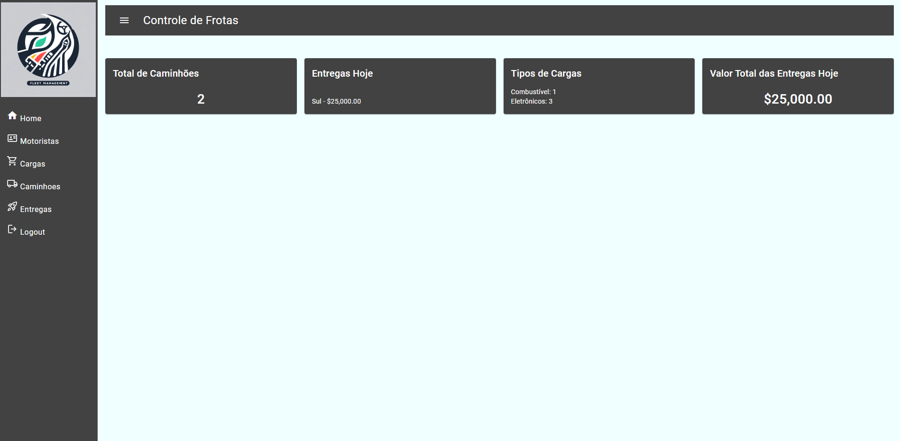
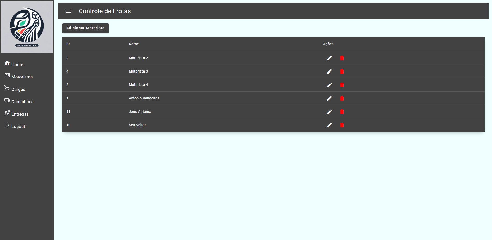
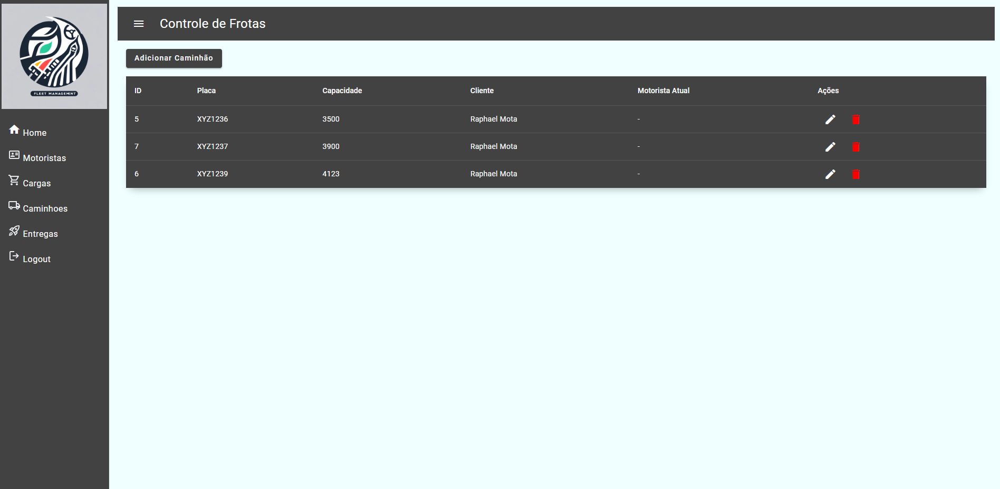
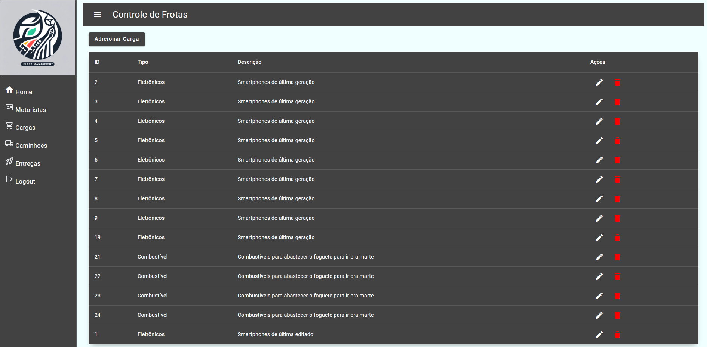
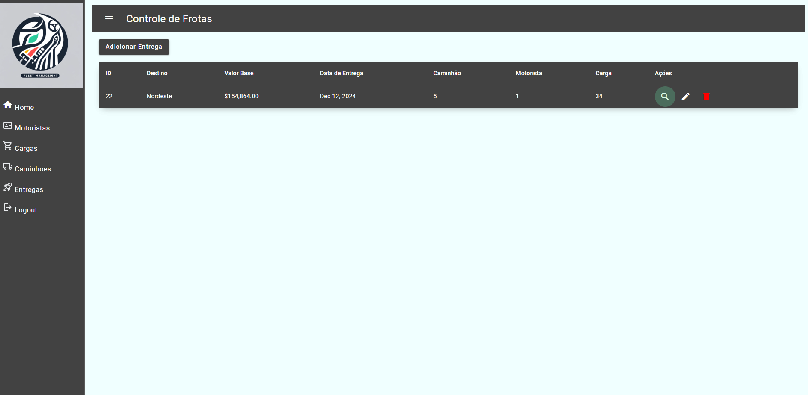

# DesafioTransportadoraFront

Este projeto foi gerado com [Angular CLI](https://github.com/angular/angular-cli) versão 16.2.14.

## Descrição do Projeto

O DesafioTransportadoraFront é um projeto front-end desenvolvido em Angular para gerenciar uma frota de caminhões e suas entregas. Ele permite que um cliente de transportadora veja informações detalhadas sobre seus caminhões, motoristas, cargas e entregas. O projeto está integrado com um backend desenvolvido em [Spring Boot](https://github.com/rphmota/transportadora-desafio).

## Funcionalidades

- **Dashboard**: Visão geral da frota de caminhões, entregas em andamento, tipos de cargas e valores totais por dia.
- **Gerenciamento de Motoristas**: Adicionar, editar e excluir motoristas.
- **Gerenciamento de Caminhões**: Adicionar, editar e excluir caminhões.
- **Gerenciamento de Cargas**: Adicionar, editar e excluir cargas.
- **Gerenciamento de Entregas**: Adicionar, editar e excluir entregas.

## Servidor de Desenvolvimento

Execute `ng serve` para iniciar um servidor de desenvolvimento. Navegue para `http://localhost:4200/`. A aplicação recarregará automaticamente se você alterar qualquer um dos arquivos de origem.

## Integração com Backend

Este projeto se integra com o backend disponível no seguinte repositório: [transportadora-desafio](https://github.com/rphmota/transportadora-desafio).


## Build

Execute `ng build` para construir o projeto. Os artefatos de construção serão armazenados no diretório `dist/`.


## Ajuda Adicional

Para obter mais ajuda sobre o Angular CLI, use `ng help` ou consulte a [Visão Geral e Referência de Comando Angular CLI](https://angular.io/cli).

## Prints da Aplicação


### Dashboard



### Gerenciamento de Motoristas



### Gerenciamento de Caminhões



### Gerenciamento de Cargas



### Gerenciamento de Entregas



---

## Estrutura do Projeto

```plaintext
src/
|-- app/
|   |-- components/
|   |   |-- dashboard/
|   |   |   |-- dashboard.component.ts
|   |   |   |-- dashboard.component.html
|   |   |   |-- dashboard.component.css
|   |   |-- motoristas/
|   |   |   |-- motoristas.component.ts
|   |   |   |-- motoristas.component.html
|   |   |   |-- motoristas.component.css
|   |   |   |-- add-motorista-dialog/
|   |   |   |   |-- add-motorista-dialog.component.ts
|   |   |   |   |-- add-motorista-dialog.component.html
|   |   |   |   |-- add-motorista-dialog.component.css
|   |   |   |-- edit-motorista-dialog/
|   |   |   |   |-- edit-motorista-dialog.component.ts
|   |   |   |   |-- edit-motorista-dialog.component.html
|   |   |   |   |-- edit-motorista-dialog.component.css
|   |   |-- caminhoes/
|   |   |   |-- caminhoes.component.ts
|   |   |   |-- caminhoes.component.html
|   |   |   |-- caminhoes.component.css
|   |   |   |-- add-caminhao-dialog/
|   |   |   |   |-- add-caminhao-dialog.component.ts
|   |   |   |   |-- add-caminhao-dialog.component.html
|   |   |   |   |-- add-caminhao-dialog.component.css
|   |   |   |-- edit-caminhao-dialog/
|   |   |   |   |-- edit-caminhao-dialog.component.ts
|   |   |   |   |-- edit-caminhao-dialog.component.html
|   |   |   |   |-- edit-caminhao-dialog.component.css
|   |   |-- cargas/
|   |   |   |-- cargas.component.ts
|   |   |   |-- cargas.component.html
|   |   |   |-- cargas.component.css
|   |   |   |-- add-carga-dialog/
|   |   |   |   |-- add-carga-dialog.component.ts
|   |   |   |   |-- add-carga-dialog.component.html
|   |   |   |   |-- add-carga-dialog.component.css
|   |   |   |-- edit-carga-dialog/
|   |   |   |   |-- edit-carga-dialog.component.ts
|   |   |   |   |-- edit-carga-dialog.component.html
|   |   |   |   |-- edit-carga-dialog.component.css
|   |   |-- entregas/
|   |   |   |-- entregas.component.ts
|   |   |   |-- entregas.component.html
|   |   |   |-- entregas.component.css
|   |   |   |-- add-entrega-dialog/
|   |   |   |   |-- add-entrega-dialog.component.ts
|   |   |   |   |-- add-entrega-dialog.component.html
|   |   |   |   |-- add-entrega-dialog.component.css
|   |   |-- edit-entrega-dialog/
|   |   |   |   |-- edit-entrega-dialog.component.ts
|   |   |   |   |-- edit-entrega-dialog.component.html
|   |   |   |   |-- edit-entrega-dialog.component.css
|   |-- services/
|   |   |-- motoristas.service.ts
|   |   |-- caminhoes.service.ts
|   |   |-- cargas.service.ts
|   |   |-- entregas.service.ts
|   |-- app.component.ts
|   |-- app.component.html
|   |-- app.component.css
|   |-- app.module.ts
|-- assets/
|-- environments/
|-- index.html
|-- main.ts
